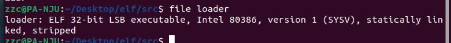
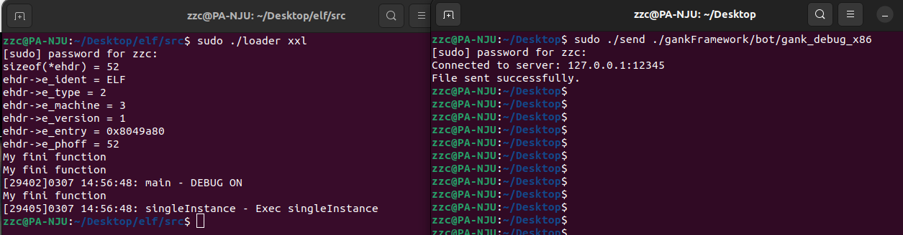
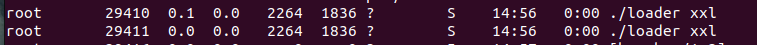

# ELF-FilelessLoad
实现了arm、x86架构的远程加载（虽然还有很多bug）

在项目https://github.com/MikhailProg/elf/tree/master的基础上进行修改。

# 构建

```bash
make ARCH=i386
```



如果要构建arm版本，需要有arm-linux-gnueabi-gcc及相关库。

# 使用方法




